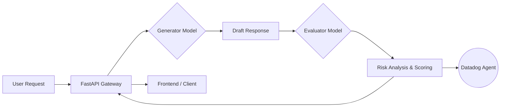

# Project Aethelgard: LLM Observability & Risk Governance

**A real-time semantic analysis gateway for Large Language Models, integrated with Datadog and Google Vertex AI.**

   

## Overview

Project Aethelgard addresses the "Black Box" problem in Generative AI. While standard monitoring tools track latency and error rates (500s), they fail to detect qualitative failures such as hallucinations, factual inaccuracies, or safety violations.

This project implements an **Active Governance Layer** that sits between the user and the LLM. Instead of passively logging requests, Aethelgard uses a secondary "Evaluator LLM" to grade every response in real-time. These risk scores are streamed via UDP to a Datadog agent, allowing DevOps teams to visualize model behavior and trigger alerts on semantic failures.

## System Architecture

The system follows a "Generator-Evaluator" pattern to ensure response integrity.

Workflow

    Generation: The primary model (Gemini Pro) generates a response to the user's prompt.

    Evaluation (The Surgeon): Before the response is finalized, a secondary lightweight model (Gemini Flash) analyzes the text for factual consistency and safety compliance.

    Telemetry: A risk score (0-100) is calculated and sent to Datadog via the DogStatsD protocol (llm.surgeon.risk_score).

    User Delivery: The response is returned to the client alongside its diagnostic metadata.

Key Features

    Semantic Guardrails: Utilizes a secondary LLM to understand context and intent, providing significantly higher accuracy than regex-based filters.

    Real-Time Telemetry: Emits custom metrics to Datadog, enabling time-series visualization of hallucination rates and safety incidents.

    Adversarial Simulation: Includes a specific testing mode to inject "jailbreak" prompts, demonstrating the system's ability to detect and flag high-risk content under pressure.

    Scalable Architecture: Built on FastAPI with asynchronous request handling to minimize latency overhead during the evaluation phase.

Tech Stack

    Backend: Python 3.10, FastAPI, Uvicorn

    AI/ML: Google Vertex AI (Gemini Pro for generation, Gemini 1.5 Flash for evaluation)

    Observability: Datadog (DogStatsD, Custom Metrics)

    Frontend: Streamlit

Installation & Setup
Prerequisites

    Python 3.10 or higher

    A Google Cloud Platform project with Vertex AI API enabled

    Datadog Agent installed and running (listening on port 8125)

1. Clone the Repository
Bash

git clone [https://github.com/vinayakkamatcodes/Aethelgard.git](https://github.com/vinayakkamatcodes/Aethelgard.git)
cd Aethelgard

2. Install Dependencies

It is recommended to use a virtual environment.
Bash

pip install -r requirements.txt

3. Configuration

Ensure your Google Cloud credentials are set up. You may need to authenticate via the gcloud CLI:
Bash

gcloud auth application-default login

4. Running the Application

The system requires two services to run simultaneously: the API backend and the frontend interface.

Start the Backend API:
Bash

uvicorn app.main:app --reload

Start the Dashboard:
Bash

streamlit run app/frontend.py

Monitoring & Metrics

Once the application is running, metrics are sent to Datadog under the namespace llm.surgeon.

    Metric Name: llm.surgeon.risk_score

    Type: Gauge

    Description: A quantitative measure (0-100) of the risk detected in the latest model response.

To view these metrics, navigate to the Metrics Explorer in your Datadog dashboard and query for llm.surgeon.risk_score.
Screenshots

Attack Simulation Mode The system detecting an adversarial prompt and flagging it as Critical Risk.

Datadog Visualization Real-time tracking of risk spikes corresponding to the attack simulation.
License

This project is licensed under the MIT License - see the LICENSE file for details.

